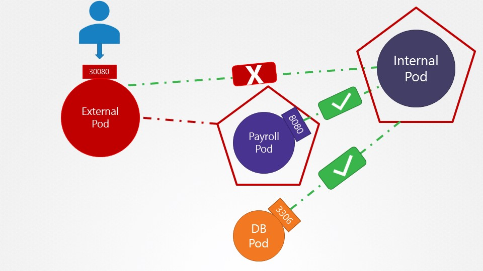

# -

### Network Policy



```yaml
apiVersion: v1
items:
- apiVersion: networking.k8s.io/v1
  kind: NetworkPolicy
  metadata:
    name: internal-policy
    namespace: default
  spec:
    podSelector:
      matchLabels:
        name: internal
    egress:
      - to:
        - podSelector:
            matchLabels:
              name: payroll
        ports:
        - port: 8080
          protocol: TCP
      - to:
        - podSelector:
            matchLabels:
              name: mysql
        ports:
        - port: 3306
          protocol: TCP
    policyTypes:
    - Egress
    - Ingress
```

### Persistent Volume

```yaml
apiVersion: v1
kind: PersistentVolume
metadata:
  name: pv-log
spec:
  accessModes:
    - ReadWriteMany
  capacity:
    storage: 100Mi
  hostPath:
    path: /pv/log
```

### Persistent Volume Claim


```yaml
apiVersion: v1
kind: PersistentVolumeClaim
metadata:
  name: claim-log-1
spec:
  accessModes:
    - ReadWriteMany
  resources:
    requests:
      storage: 50Mi
```

### Mount Volume with Pod

```yaml
apiVersion: v1
kind: Pod
metadata:
  name: webapp
spec:
  containers:
  - image: kodekloud/event-simulator
    imagePullPolicy: Always
    name: event-simulator
    volumeMounts:
    - mountPath: /log
      name: app-log
  volumes:
  - persistentVolumeClaim:
      claimName: claim-log-1
    name: app-log
```


OUT OF SYLLABUS

Static Provisioning


Dynamic Provisioning


# Security

##### kubeconfig file
location .kube directory
```yaml
apiVersion: v1
current-context: orbstack
kind: Config
preferences: {}
clusters:
  - cluster:
      certificate-authority-data: dummydata
      server: https://0.0.0.0:49630
    name: k3d-mycluster
  - cluster:
      certificate-authority-data: dummydata
      server: https://127.0.0.1:26444
    name: orbstack
contexts:
  - context:
      cluster: k3d-mycluster
      user: admin@k3d-mycluster
    name: k3d-mycluster
  - context:
      cluster: orbstack
      user: orbstack
    name: orbstack
users:
  - name: admin@k3d-mycluster
    user:
      client-certificate-data: abcdummy
      client-key-data: dummydata
  - name: orbstack
    user:
      client-certificate-data: dummydata
      client-key-data: dummydata
```


> k config view


```
controlplane ~ ➜  ls -la
total 64
drwx------    1 root     root          4096 Dec  6 04:11 .
dr-xr-xr-x    1 root     root          4096 Dec  6 03:37 ..
-rw-r--r--    1 root     root          1391 Dec  6 03:37 .bash_profile
-rw-r--r--    1 root     root           281 Sep 25 06:28 .bashrc
drwxr-xr-x    3 root     root          4096 Dec  6 03:37 .cache
drwxr-xr-x    1 root     root          4096 Sep 25 06:28 .config
drwxr-x---    3 root     root          4096 Dec  6 03:37 .kube
drwx------    2 root     root          4096 Dec  6 03:50 .ssh
drwx------    2 root     root          4096 Dec  6 03:50 .terminal_logs
drwxr-xr-x    4 root     root          4096 Dec  6 03:37 .vim
-rw-------    1 root     root          2271 Dec  6 04:11 .viminfo
-rw-r--r--    1 root     root           111 Dec  6 03:37 .vimrc
-rw-r--r--    1 root     root          3628 Dec  6 04:11 elephant.yaml
-rw-r--r--    1 root     root          2981 Dec  6 03:55 exp.yaml
-rw-r--r--    1 root     root             0 Dec  6 03:52 r.yaml
-rw-r--r--    1 root     root             0 Dec  3 11:24 sample.yaml

controlplane ~ ➜  cd .kube/

controlplane ~/.kube ➜  ls
cache   config

controlplane ~/.kube ➜  cat config
apiVersion: v1
clusters:
- cluster:
    certificate-authority-data: LS0tLS1CRUdJTiBDRVJUSUZJQ0FURS0tLS0tCk1JSUJlRENDQVIyZ0F3SUJBZ0lCQURBS0JnZ3Foa2pPUFFRREFqQWpNU0V3SHdZRFZRUUREQmhyTTNNdGMyVnkKZG1WeUxXTmhRREUzTXpNME5UWXlNamd3SGhjTk1qUXhNakEyTURNek56QTRXaGNOTXpReE1qQTBNRE16TnpBNApXakFqTVNFd0h3WURWUVFEREJock0zTXRjMlZ5ZG1WeUxXTmhRREUzTXpNME5UWXlNamd3V1RBVEJnY3Foa2pPClBRSUJCZ2dxaGtqT1BRTUJCd05DQUFROWZvbW1PWDByUWVLUjkwU21UZ3ZvN2hQRTdmRkNwYUNYN3B6dUlTM3kKdDVUYnhQYnlYSnhrd0tjRVQySnBkeGJHejdGWit6alAxa093SzFvdTh0czJvMEl3UURBT0JnTlZIUThCQWY4RQpCQU1DQXFRd0R3WURWUjBUQVFIL0JBVXdBd0VCL3pBZEJnTlZIUTRFRmdRVUxLay9lcE9LeUdBT1ZXS3BUUUxGCm9ka1pFYTB3Q2dZSUtvWkl6ajBFQXdJRFNRQXdSZ0loQU9SRWdvSFZ0WVdnd1dxWDFZV2tqV25HOVVzWlU4UEYKaVN0dWNlNzZ4TFJOQWlFQWdvVWVvbUpoWDROU1NNU2xaZ2E3WUdlMFI2K21TVFNsRFpCdHZlc3dteFk9Ci0tLS0tRU5EIENFUlRJRklDQVRFLS0tLS0K
    server: https://127.0.0.1:6443
  name: default
contexts:
- context:
    cluster: default
    user: default
  name: default
current-context: default
kind: Config
preferences: {}
users:
- name: default
  user:
    client-certificate-data: LS0tLS1CRUdJTiBDRVJUSUZJQ0FURS0tLS0tCk1JSUJrVENDQVRlZ0F3SUJBZ0lJQ0JybHpsSWp5L1V3Q2dZSUtvWkl6ajBFQXdJd0l6RWhNQjhHQTFVRUF3d1kKYXpOekxXTnNhV1Z1ZEMxallVQXhOek16TkRVMk1qSTRNQjRYRFRJME1USXdOakF6TXpjd09Gb1hEVEkxTVRJdwpOakF6TXpjd09Gb3dNREVYTUJVR0ExVUVDaE1PYzNsemRHVnRPbTFoYzNSbGNuTXhGVEFUQmdOVkJBTVRESE41CmMzUmxiVHBoWkcxcGJqQlpNQk1HQnlxR1NNNDlBZ0VHQ0NxR1NNNDlBd0VIQTBJQUJCRVB1Q25RWFRWTW5BcEIKZ0k5ejRiNEhUZlNlYXIvS0lxLzJTS0FrNGtsbW8yRXZnSkxiT1ZhZVFyc0wySDMwbkthZFpjUWZuTThTRWFZMgpIU2p1NC9xalNEQkdNQTRHQTFVZER3RUIvd1FFQXdJRm9EQVRCZ05WSFNVRUREQUtCZ2dyQmdFRkJRY0RBakFmCkJnTlZIU01FR0RBV2dCUUVmRG92eDVMVlpncDllTDRwbVFWa1ZsYXM2VEFLQmdncWhrak9QUVFEQWdOSUFEQkYKQWlFQWxybEZjRHJpWmNpT0srTlQ2YS9RdUI3Z0U2enc3bGNWbDF6VkY4WVluVTBDSUJVZFFLZHZiZGtmb2R6NwpEYmhCL0lHMVhQbmFYWWtvanlsU0k2R2hROURXCi0tLS0tRU5EIENFUlRJRklDQVRFLS0tLS0KLS0tLS1CRUdJTiBDRVJUSUZJQ0FURS0tLS0tCk1JSUJkakNDQVIyZ0F3SUJBZ0lCQURBS0JnZ3Foa2pPUFFRREFqQWpNU0V3SHdZRFZRUUREQmhyTTNNdFkyeHAKWlc1MExXTmhRREUzTXpNME5UWXlNamd3SGhjTk1qUXhNakEyTURNek56QTRXaGNOTXpReE1qQTBNRE16TnpBNFd0h3WURWUVFEREJock0zTXRZMnhwWlc1MExXTmhRREUzTXpNME5UWXlNamd3V1RBVEJnY3Foa2pPClBRSUJCZ2dxaGtqT1BRTUJCd05DQUFUd1FNTEVQMXNKeGNha2VLeEJjMUxDbVowK2hsMkhybFA4Zm5Ba2ZNVlUKS2JBY2I0M2JjZjl3YWNVZVZxSlAvTzlFdk52UGExUWxna0VhaVAxMmVMUjlvMEl3UURBT0JnTlZIUThCQWY4RQpCQU1DQXFRd0R3WURWUjBUQVFIL0JBVXdBd0VCL3pBZEJnTlZIUTRFRmdRVUJIdzZMOGVTMVdZS2ZYaStLWmtGClpGWldyT2t3Q2dZSUtvWkl6ajBFQXdJRFJ3QXdSQUlnUm1qMWtlZ3FtVkI1QmZzQmkyUnFxR0xNOVBLVmVtV3kKdnVCdVMwb3J5NW9DSUVVL3RQRUgvbWpMT3lHNDVrZ1hsTWtSWlB3Smxvc2ZQQ2hBVEErZnoybk8KLS0tLS1FTkQgQ0VSVElGSUNBVEUtLS0tLQo=
    client-key-data: LS0tLS1CRUdJTiBFQyBQUklWQVRFIEtFWS0tLS0tCk1IY0NBUUVFSUtZSlMvbkJGeGRVa0prTDN4GU3paRUZoYkcyTmVvQW9HQ0NxR1NNNDkKQXdFSG9VUURRZ0FFRVErNEtkQmROVXljQ2tHQWozUGh2Z2ROOUo1cXY4b2lyL1pJb0NUaVNXYWpZUytBa3RzNQpWcDVDdXd2WWZmU2NwcDFseEIrY3p4SVJwallkS083aitnPT0KLS0tLS1FTkQgRUMgUFJJVkFURSBLRVktLS0tLQo=

controlplane ~/.kube ➜
```
